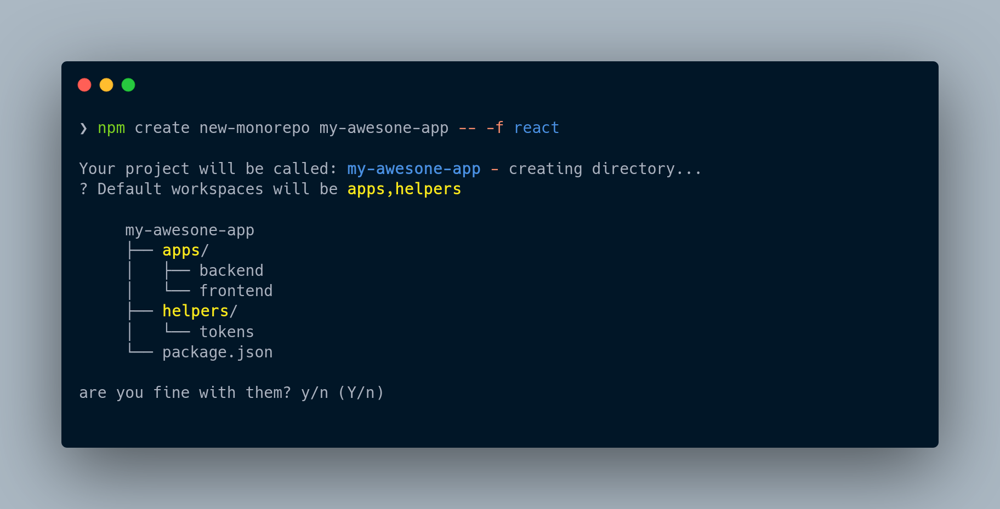

# Create new monorepo
This project is a starter CLI for scaffold new monorepos in a simpler way. It follows the Rapid Application Development (RAD) philosophy.  

The resulting monorepo will be managed by `npm` but you can set any application you want (even with apps in PHP or Python).  


## Usage

**You don't need to install anything**.  
Simply run this command on your terminal and answer the questions: 
```sh
npm create new-monorepo <project-name>
```

Then, after the scaffold simply run:
```
npm start
```
It will launch the frontend and backend server.



## Available options

You can pass options preceeded by `--` to avoid interactivity: 
```sh
npm create new-monorepo <project-name> -- -b django -f react
```
This will create a `django` app under `/backend` and a `react` app under `/frontend` directory.

The available options are:

|   Command  | shorthand |                                                             example                                                    |
|:----------:|:---------:|------------------------------------------------------------------------------------------------------------------------|
|  --project |     -p    | `npm create new-monorepo -- -p my-project`  <br>Alternatively use an argument:<br>`npm create new-monorepo my-project` |
| --frontend |     -f    | `npm create new-monorepo my-project -- -f react`                                                                       |
|  --backend |     -b    | `npm create new-monorepo my-project -- -b django`                                                                      |

### Available templates:
At the moment this are the available templates: 

| Frontend                                                                      |
|-------------------------------------------------------------------------------|
| `vanilla`, `react`, `vue`, `svelte`, `solid`, `qwik`, `preact`, `lit`, `none` |

| Backend                                                                       |
|-------------------------------------------------------------------------------|
| `laravel`, `django`, `none`                                                   |

## Notes: 

If you choose `django` or `laravel` as a backend service you will need to have installed the requirements (either `django-admin` or php `composer` in the device). This CLI will check if they are installed and exit with an error explanation if not. Due to this ckecking process (that uses POSIX-compliant system) this CLI will not work on Windows at the moment (in the future proper compatibility will be implemented).